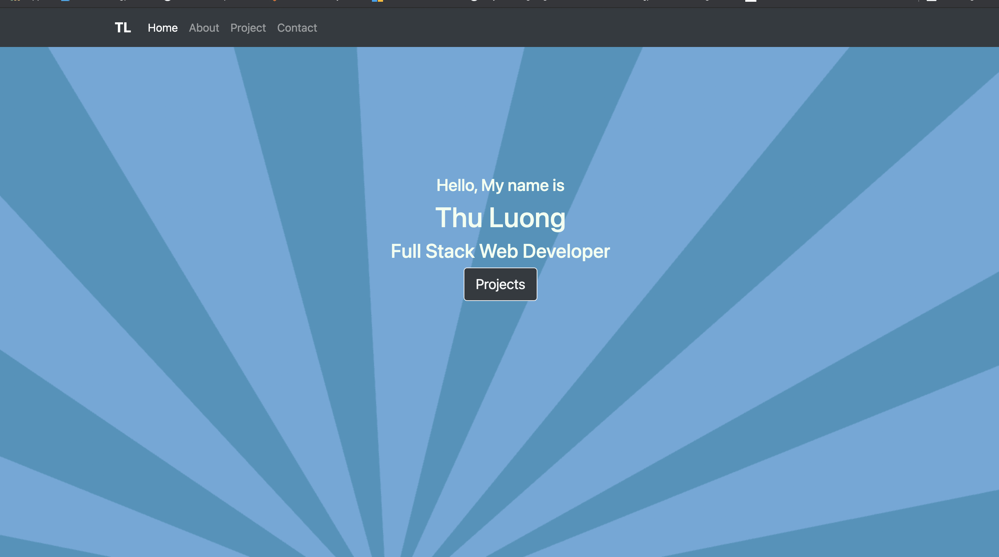
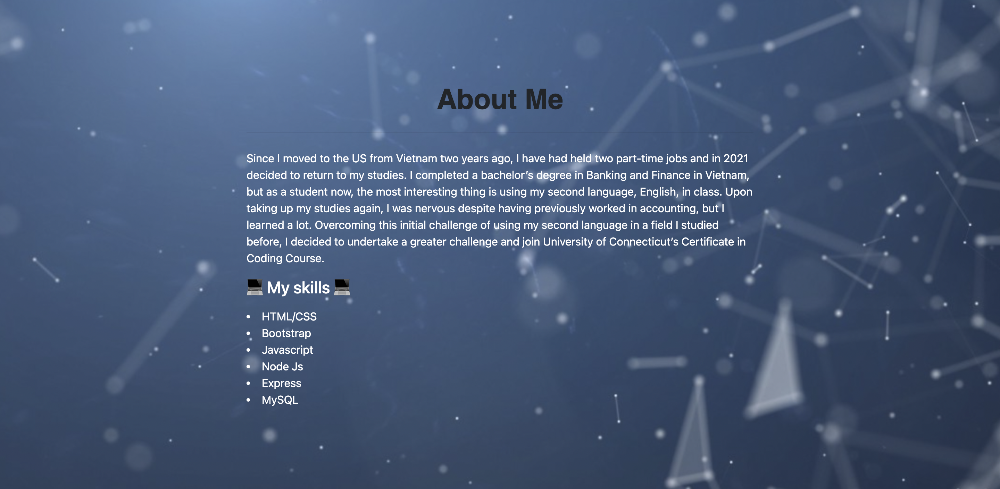
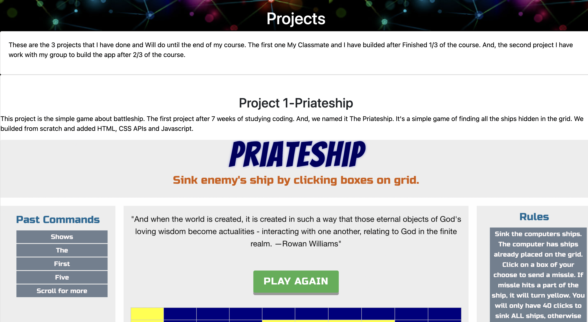
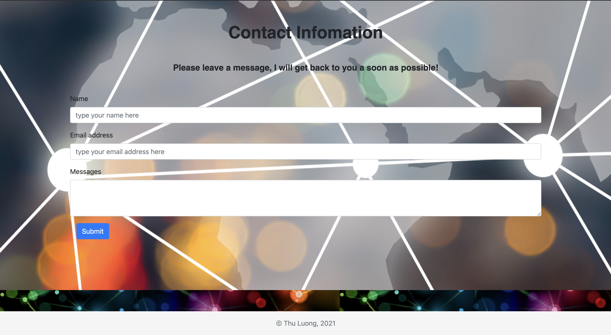

# hw20-react-portfolio

[](https://lbesson.mit-license.org/)


# 📋 Description 📋

```
This is a portfolio showing a completed project that I have done so far as well as the other projects. It has been done over using react components for the front-end.

```

# 💼 Technologies Used 💼

* `Node.js`
* `npm (Node Package)`
* `Javascript`
* `React`
* `Fontawesome`
* `React Router`
* `CSS`


# 📸 Screenshots 📸













# 🔗 Application Link

* [Github]( https://thuluong249.github.io/hw20-react-portfolio/)

# 📱 Contact 

* [Github](https://github.com/thuluong249)

* <a href="mailto:thujtn2019@gmmail.com">💌 Email</a> 

---